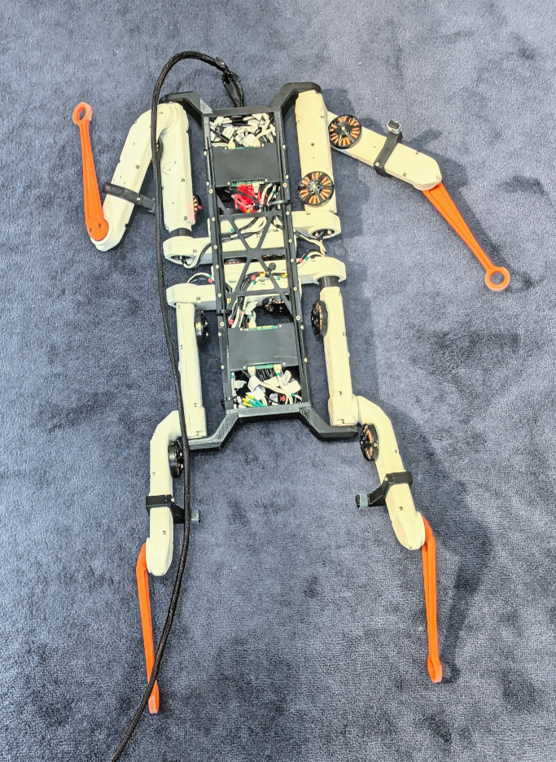
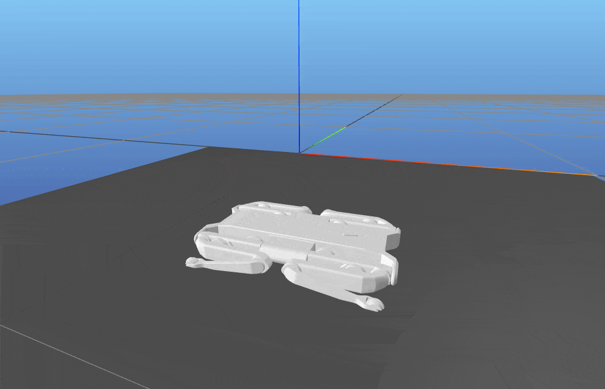
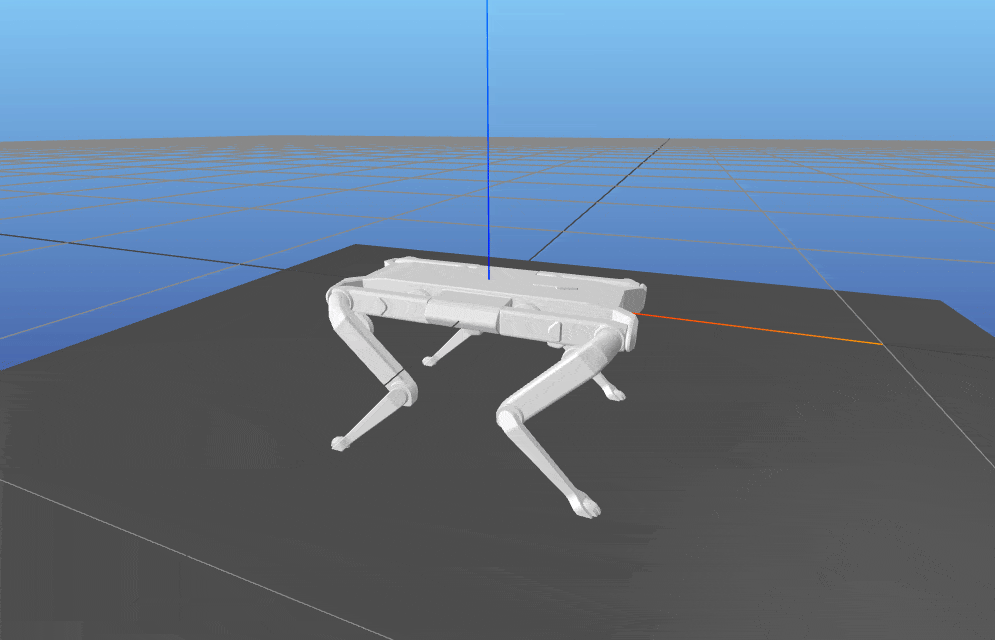
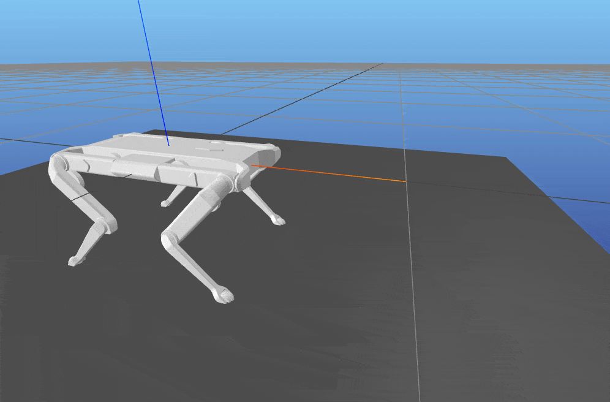
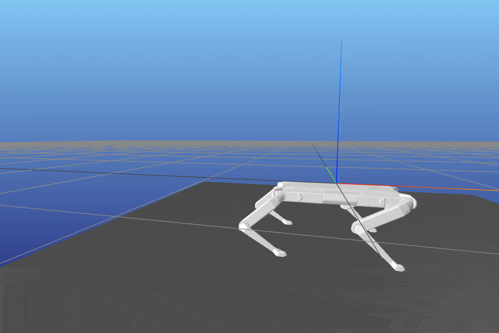

# Quadruped Trajectory Optimization

This is a trajectory optimization program written to generate agile motions for my [home-built Solo-12 quadruped](https://odri.discourse.group/t/youre-building-an-odri-robot-tell-us-about-it/533/13):

<div align="center">


 
### Spoiler: <ins>[It backflips.](#backflip)</ins>🤸

</div>

## Capabilities

With this framework, you can generate agile motions such as:

|`GetUpTask`|`JumpTaskInPlace`|`JumpTaskFwd` & `JumpTaskBwd`|`BackflipLaunch` & `BackflipLand`| 
|---|---|---|---|
|  |  |  |  |

The task descriptions for each of these trajectories are included in [`tasks.py`](src/tasks.py).

Currently, only the [Solo12](https://github.com/open-dynamic-robot-initiative/open_robot_actuator_hardware/blob/master/mechanics/quadruped_robot_12dof_v1/README.md) quadruped is supported, however, the code can be extended to support different robots.


Features:

- **Simultaneous subproblem solving and stitching**: A trajectory can be defined and solved in multiple parts connected by (optional) continuity constraints

- **Easy trajectory constraint description**: A task can define constraints on torques, state, velocities, and frame placements and new ones can be simply added

- **Previous solution initial guess**: A low frequency solution can be interpolated via simple knot repetition and provided as an initial guess to a higher frequency problem

- **HDF5 export**: A trajectory can be exported to .hdf5 to be executed on hardware (using [solo12_tools](https://github.com/rkourdis/solo12_tools))

## Backstory

One day, I asked myself:

_"If Boston Dynamics can make their robots do backflips, why can't I?"_ 🤔

... so I set out to build a quadruped 🤖. A few months later, with the quadruped at hand, I still had no clue _how_ to do the backflip.

This code is the _how_.

### Resources

I learned about *offline trajectory optimization* from:

- The excellent paper by Matthew Kelly: [`Transcription Methods for Trajectory Optimization`](https://epubs.siam.org/doi/10.1137/16M1062569)

- The paper by Posa et al.: [`A Direct Method for Trajectory Optimization of
Rigid Bodies Through Contact`](https://groups.csail.mit.edu/robotics-center/public_papers/Posa13.pdf)

- My friend, [Henrique](https://ferrolho.github.io/), who's been doing [very](https://www.youtube.com/watch?v=5uF3VqgjiVE), [cool](https://www.youtube.com/watch?v=1M32AHuuDhI), [things](https://x.com/hferrolho/status/1827764537119916188) with robots for a long time

## Getting Started

### Prerequisites

- Python 3.10

- [Pinocchio 3](https://github.com/stack-of-tasks/pinocchio) for differentiable robot dynamics, along with dependencies included in [BUILD_PIN3.txt](dependencies/BUILD_PIN3.txt) (**Note:** Code only works on branch `pinocchio3-preview`, commit `97f40f9`)

- A license for the [Artelys Knitro](https://www.artelys.com/solvers/knitro/) optimizer (**Note:** Only tested with v14.0.0)

Make sure to fetch the robot model after cloning:

```
git submodule update --recursive --init
```

Example task descriptions can be found under [`tasks.py`](src/tasks.py). An optimization problem needs to be defined by providing task and continuity info in [`main.py`](src/main.py).

- **To start the optimization with a discretization frequency of 20Hz:** `python3 ./src/main.py --freq=20`.

- **To visualise the solution:** `python3 ./src/main.py --freq=20 --visualize_file=./solution_20hz.bin`.

## Algorithm Description

To generate a robot trajectory, this code uses the **Direct Transcription** method.

#### Transcription
Loosely described: robot state, velocity, acceleration and system input (torques) are discretized in time. Decision variables are created for each timestep ("knot"). Constraints such as torque limits, desired torso orientation, etc. _are enforced directly on these decision variables_.

The decision variables of a knot are connected to the variables of the knot before and after by robot physics, contact dynamics and an integration scheme. These are written as additional variable constraints.

#### Optimization Objective
An optimization problem is defined _for all decision variables_ by defining a metric to be minimized. A common choice is to minimize the overall trajectory energy. The metric could even be set constant so that the solver searches for _any_ feasible solution.

**_The variables, constraints and objective define a Non Linear Program (NLP) the solution to which is a robot trajectory._**

#### Contacts

Contacts are handled explicitly. The times that each foot is on the ground are _predefined and not optimized for_. While a foot is on the ground, reaction forces are calculated to enforce the contact constraint.

#### Output & Execution
The problem solution contains joint inputs required to achieve the optimized trajectory. The system state at every point is also included. The input torques for each joint can be sent to the robot for execution.

An additional PD controller tracking the reference joint angles and velocities is used in practice. This ensures that small modelling discrepances do not result in large deviations between the desired and actual trajectory.

## Backflip

<div align="center">

https://github.com/user-attachments/assets/cc01dda4-99c6-46f2-be99-1b2db49bf93e

</div>

To generate the backflip I've performed on my Solo-12 (`trajectories/backflip_v4/backflip_v4.hdf5`) a multi-step process is required.
This is because the full high-frequency optimization problem is difficult, so a series of better and better initial guesses need to be used.

**_In each optimization we either upscale the previous solution (via simple knot repetition) and use it as the initial guess  or _use it as-is_._**

---
#### Step 1: 20Hz feasible solution from standing guess, with relaxed constraints:

_Under tasks `BackflipLaunch` and `BackflipLand`:_
 
1. Comment out `HFE_Limit_Constraints`
1. Set `traj_error = lambda t, kvars: 0.0` to search for _any_ feasible solution
    
_Under `robot.py`:_
1. Set `self.τ_norm_max = ca.inf` to disable the torque norm limit

_**Run:**_ `python3 ./src/main.py --freq=20 && mv solution_20hz.bin solution_20hz_v1.bin`

> This converges after 556 iterations with abs. feas. error = 2.23e-04

---
#### Step 2: 20Hz feasible solution, with HFE rotation constraints:

_Under tasks `BackflipLaunch` and `BackflipLand`:_
1. Uncomment `HFE_Limit_Constraints` to enable HFE limits


_**Run:**_ `python3 ./src/main.py --freq=20 --prev_solution_file=./solution_20hz_v1.bin && mv solution_20hz.bin solution_20hz_v2.bin`

> This converges after 183 iterations with abs. feas. error = 7.11e-07

---

#### Step 3: 40Hz feasible solution, with same constraints:

_**Run:**_ `python3 ./src/main.py --freq=40 --prev_solution_file=./solution_20hz_v2.bin --interp_factor=2`

> This converges in 1456 iterations with abs. feas. error = 5.44e-04

---

#### Step 4: 80Hz feasible solution, with same constraints as previous solution:

_**Run:**_ `python3 ./src/main.py --freq=80 --prev_solution_file=./solution_40hz.bin --interp_factor=2 && mv solution_80hz.bin solution_80hz_v1.bin`

> This *does not* meet the final feasibility tolerance, stopping after 1485 iterations with abs. error = 1.89e-01. However, the trajectory produced **is still a good initial guess** for the next step.

---

#### Step 5: 80Hz min torque solution, with all constraints:

_Under tasks `BackflipLaunch` and `BackflipLand`:_
1. Set `traj_error = lambda t, kvars: ca.norm_2(kvars.τ)` to produce a min RMS torque solution

_Under `robot.py`:_
1. Set `self.τ_norm_max = 8.0` to enable the torque norm limit

_**Run:**_ `python3 ./src/main.py --freq=80 --prev_solution_file=./solution_80hz_v1.bin && mv solution_80hz.bin solution_80hz_v2.bin`

> This *does not* meet the final feasibility tolerance. Stops after 1732 iterations with abs. error = 2.075e-03.

---

#### Step 6: 80Hz min torque reoptimization, with all constraints:

_With the previous solution as the initial guess, restarting the optimization results in a trajectory
that meets the required feasibility threshold._

_**Run:**_ `python3 ./src/main.py --freq=80 --prev_solution_file=./solution_80hz_v2.bin --hdf5_file=backflip_v4.hdf5 && mv solution_80hz.bin solution_80hz_v3.bin`

> Converges after 463 iterations with feas. error = 5.34e-04 and final objective = 2.82148241260696e+00.

---


_The output file `backflip_v4.hdf5` contains torques, joint positions and velocities and can be executed on the Solo-12 hardware._

## Improvements
- Implicit contact time optimization - optimization problem as an LCP
- Better initial guess generation - maybe optimize a guess with the torso as a single rigid body?
- Better interface for toggling constraints / objectives via the CLI
